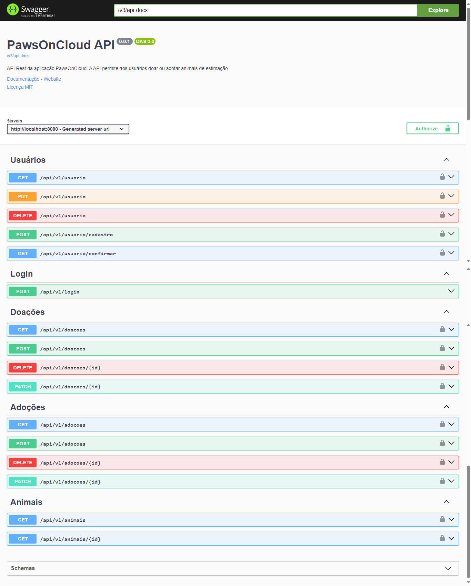
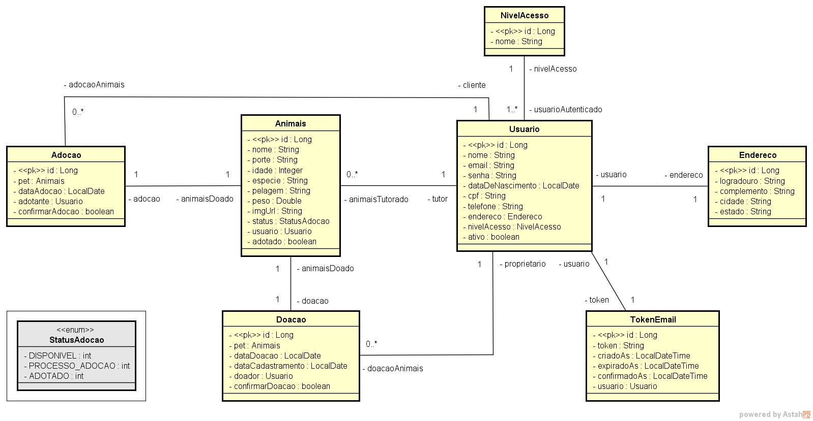

<h1 align="center">PawsOnCloud</h1> 


<br>

### Tópicos 

:small_blue_diamond: [Descrição do projeto](#descrição-do-projeto)

:small_blue_diamond: [Funcionalidades](#funcionalidades)

:small_blue_diamond: [Layout da Aplicação](#layout-da-aplicação-dash)

:small_blue_diamond: [Pré-requisitos](#pré-requisitos)

:small_blue_diamond: [Como rodar a aplicação](#como-rodar-a-aplicação-arrow_forward)

## :book: Descrição do projeto 

<p align="justify">
Esta é a API Rest da aplicação PawsOnCloud, desenvolvida em Java e Spring Boot. O sistema permite que os usuários doem e adotem animais de estimação. Alguns dos principais recursos do sistema incluem:

- Doar: Os usuários podem divulgar os animais que estão disponíveis para adoção, descrevendo detalhes sobre o pet.

- Adotar: Os usuários podem adotar os animais que estão disponíveis, entrando em contato diretamente com o proprietário do animal.
</p>

<p>Para mais detalhes sobre a API, basta acessar a <a href="https://edielson-assis.github.io/documentacao-pawsoncloud/">documentação</a>.</p>

<p>O front-end dessa aplicação pode ser acessado <a href="https://brunagiammelaro.github.io/sprint2-proz/">aqui</a>.</p>

## :bulb: Funcionalidades

### :lock: Autenticação do usuário

- `Login de usuário`: O usuário deve fazer login para se autenticar na plataforma. Credênciais que devem ser usadas: email e senha. Toda comunicação e feita via token JWT.
- `Cadastro do usuário`: Caso o usuário não possua cadastro, deverá se cadastrar para conseguir fazer login. 
- `Atualização do usuário`: Usuários autenticados podem atualizar os próprios dados de cadastro.
- `Exclusão da conta do usuário`: O usuário poderá excluir a sua conta da plataforma.

### :bust_in_silhouette: Doação de animais

- `Doar pets`: O usuário poderá posta a imagem e detalhes dos pets que deseja doar.
- `Atualizar uma doação`: O usuário confirmará se o pet foi doado.
- `Listar todas as doações`: O usuário poderá listar todas as doações que ele realizou.
- `Cancelar uma doação`: Caso uma doação não tenha sido finalizada, o usuário poderá cancelá-la, caso desista de doar o pet.

### :bust_in_silhouette: Adoção de animais

- `Adotar pets`: O usuário poderá adotar apenas os pets que estiverem com o status **Disponível**.
- `Atualizar uma adoção`: O usuário confirmará se o pet foi adotado.
- `Listar todas as doações`: O usuário poderá listar todas as adoções que ele realizou.
- `Cancelar uma adoção`: Caso uma adoção não tenha sido finalizada, o usuário poderá cancelá-la, caso desista de adotar o pet.

### :cat: Visualização de animais

- `Listar animais`: O usuário poderá listar todos os animais que estiverem disponíveis para adoção.
- `Pesquisar pelo id`: O usuário poderá pesquisar o animal pelo id.

## Swagger :dash:



## :toolbox: Modelo conceitual



## Pré-requisitos

- [x] Java JDK 17
- [x] IDE para desenvolvimento Java 
- [x] Git
- [x] Conta no GitHub
 
## Como rodar a aplicação :arrow_forward:

Faça um fork do projeto, após isso, abra o terminal do git bash na pasta onde deseja salvar o projeto, e digite o seguinte comando: 

```
git clone git@github.com:edielson-assis/pawsOnCloud.git
``` 
Crie uma base de dados no MySQL com o nome **projeto_integrador**. Não é necessário criar as tabelas.

Em seguida, abra o projeto na IDE de sua preferência, atualize o arquivo **application.properties** com os dados da base de dados criada e execute-o a partir do método **main**.

Após executar o projeto, abra o seu navegador de internet e, na barra de endereço, digite o seguinte comando:

```
http://localhost:8080/swagger-ui/index.html
```
Agora é só testar as funcionalidades do projeto. Não se esqueça de se registrar e fazer login para se autenticar na plataforma. Toda comunicação entre os endpoints é feita via token JWT.

## Linguagens, dependencias e libs utilizadas :books:

- [Java](https://docs.oracle.com/en/java/javase/17/docs/api/index.html)
- [Maven](https://maven.apache.org/ref/3.9.3/maven-core/index.html)
- [Lombok](https://mvnrepository.com/artifact/org.projectlombok/lombok)
- [MySQL Connector](https://mvnrepository.com/artifact/mysql/mysql-connector-java)
- [Spring Data JPA](https://mvnrepository.com/artifact/org.springframework.data/spring-data-jpa/3.2.1)
- [Bean Validation API](https://mvnrepository.com/artifact/jakarta.validation/jakarta.validation-api/3.0.2)
- [Spring Boot Starter Web](https://mvnrepository.com/artifact/org.springframework.boot/spring-boot-starter-web)
- [Flyway MySQL](https://mvnrepository.com/artifact/org.flywaydb/flyway-mysql/9.22.2)
- [Flyway Core](https://mvnrepository.com/artifact/org.flywaydb/flyway-core/9.22.2)
- [Spring Security](https://mvnrepository.com/artifact/org.springframework.boot/spring-boot-starter-security/3.1.4)
- [Java JWT](https://mvnrepository.com/artifact/com.auth0/java-jwt/4.4.0)
- [Swagger](https://mvnrepository.com/artifact/org.springdoc/springdoc-openapi-starter-webmvc-ui/2.3.0)
- [Spring Mail](https://mvnrepository.com/artifact/org.springframework.boot/spring-boot-starter-mail/3.2.1)

## :gear: Atualizações futuras
### Back End
- [ ] Escrever testes unitários.
- [ ] Escrever testes de integração.
- [ ] Alterar o link de validação para redirecionar os usuários para uma página web.
- [ ] Criar um método para deletar ou atualizar o token de validação, caso o usuário realize o cadastro, mas não valide o email.
- [ ] Implementar as funcionalidades para a página do blog.
- [ ] Implementar as funcionalidades para a página das ongs.
- [ ] Após finalizar a documentação, remover os comentários para deixar o código mais limpo.

### Front End
- [ ] Criar uma página para receber o token de validação e retornar se o email foi validado.
- [ ] Alterar a estrutura da página de adoção para gerar os cards dinamicamente.
- [ ] Criar o menu do usuário.
- [ ] Dsiponibilizar o acesso ao formulário de adoção e doação no menu do usuário.
- [ ] Retirar os formulários de adoção e doação da página de cadastramento.
- [ ] Trocar a implementação da página de ongs para pegar os dados diretamente do banco de dados.
- [ ] Alterar a estrutura da página de blog para reproduzir as postagens dinamicamente.

## Licença 

The [MIT License](https://github.com/edielson-assis/pawsOnCloud/blob/main/LICENSE) (MIT)

Copyright :copyright: 2024 - PawsOnCloud
